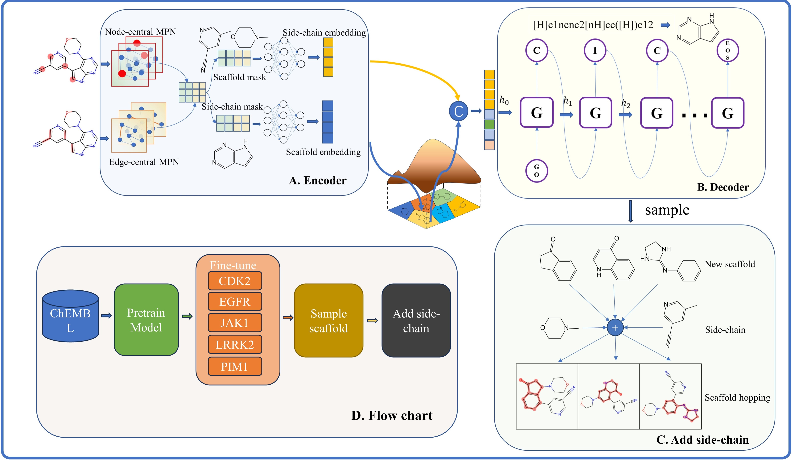

# ScaffoldGVAE
ScaffoldGVAE: A Variational Autoencoder Based on Multi-View Graph Neural Networks for Scaffold Generation and Scaffold Hopping of Drug Molecules

# Installation
You can use the environment.yml file to create a new conda environment with all the necessary dependencies for ScaffoldGVAE.
```
git clone git@github.com:ecust-hc/ScaffoldGVAE.git
cd ScaffoldGVAE
conda env create -f environment.yml
conda activate ScaffoldGVAE
```
# Usage
ScaffoldGVAE includes three sub-modules:
1. `Sca_extraction.py`: The molecular scaffolds was extracted and the data set was constructed.

2. `Train.py`: Used for pre-training on big dataset.

3. `fine_tuning.py`: Used for fine-tuning the pre-trained neural network on the known bioactive compounds against specific protein targets.

4. `sample.py`: Given a reference molecule and its corresponding scaffold ,sampling new scaffolds and adding side-chain for scaffold hopping.

Example of running the command:
```
python Sca_extraction.py

python pre_train.py

python fine_tuning.py

python sample.py
```